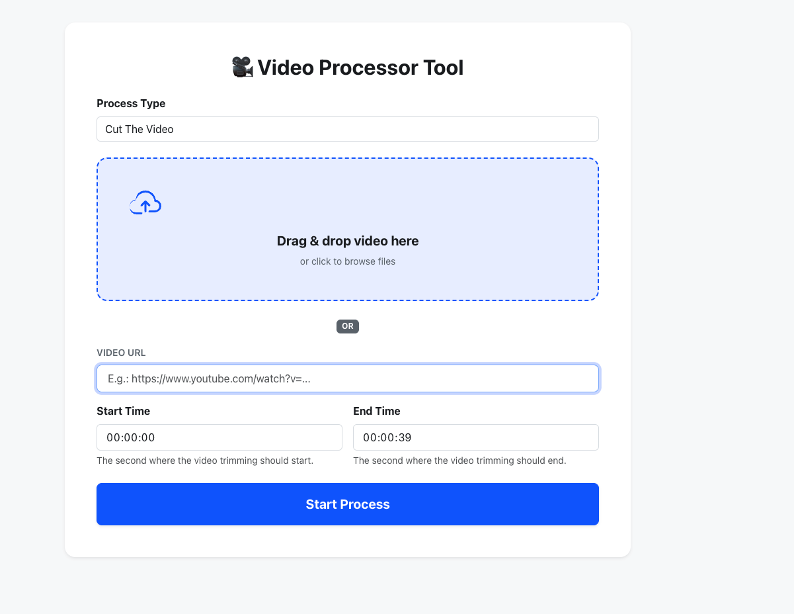
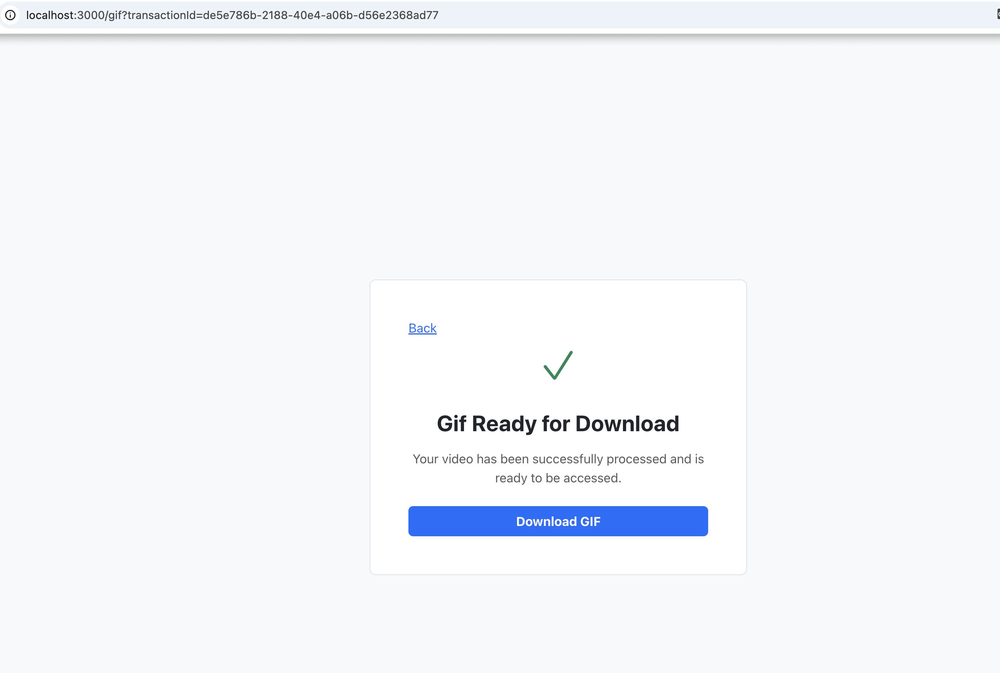

## Quick Setup


``` bash
git clone https://github.com/ufukpalavar52/video-project-mcp.git
cd video-project
cp env.example .env
docker-compose up -d video-ui video-processor video-handler-mcp
``` 
### Important Note

If you want to use OpenAI, you can configure your environment variables as follows:

``` bash
OPENAI_API_KEY=api-key 
OPENAI_BASE_URL=
OPENAI_AI_MODEL=open-ai-model
``` 

If you have your own provider that supports the OpenAI SDK, you can set the following values according to that provider:

``` bash
OPENAI_API_KEY=api-key
OPENAI_BASE_URL=https://my-ai-provider.example.com/v1
OPENAI_AI_MODEL=my-model
```
If you don’t have any AI provider, you can run the following command and use **llama3.2** via **Ollama**:

```bash
docker-compose up -d ollama
```

The related configuration in the .env file should be as follows:

```bash
OPENAI_API_KEY=api-key
OPENAI_BASE_URL=http://ollama:11434/v1
OPENAI_AI_MODEL=llama3.2

```

## Video Upload Page


## Download Page


## Sample GIF
